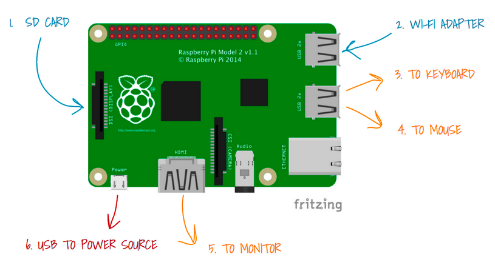

# SmartLock-PubNub

Unlock your door with your device by giving key less entry access

# Raspberry Pi



Once you setup Raspberry Pi, you can install PubNub Python SDK using following line:

```
pip install 'pubnub>=4.0.13'
```

Executing raspberryAccess.py grants access to the specific channel and user specified by you.

# Valid Key

validKey.js has data of a valid user who can access the Smart Lock and unlock it.

# Invalid Key

invalidKey.js has data of a user with invalid ```authKey```. The access to this user should be denied.

# References

PubNub Access Manager - https://www.pubnub.com/docs/tutorials/pubnub-access-manager
Python Access Manager - https://www.pubnub.com/docs/python/api-reference-access-manager
